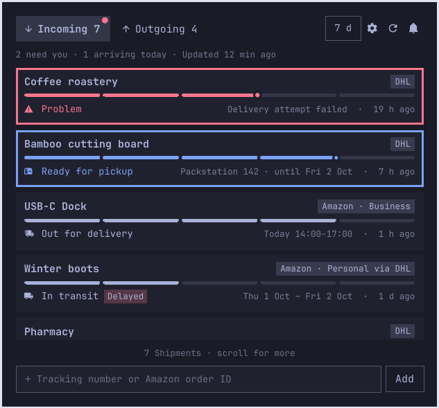
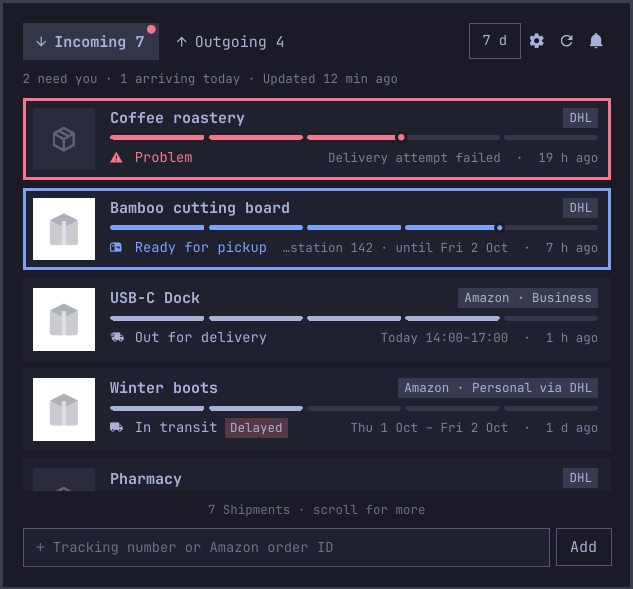
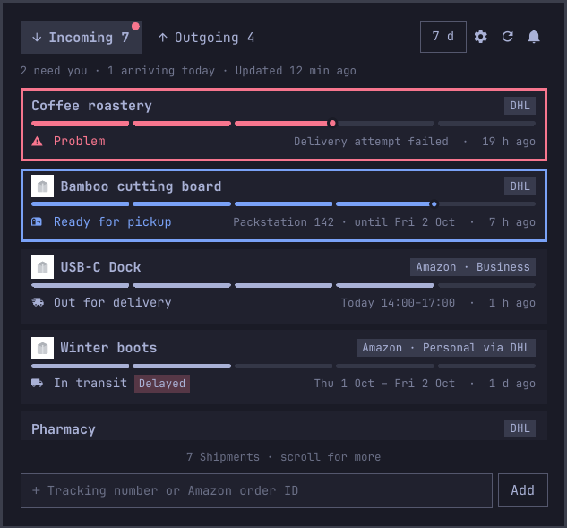
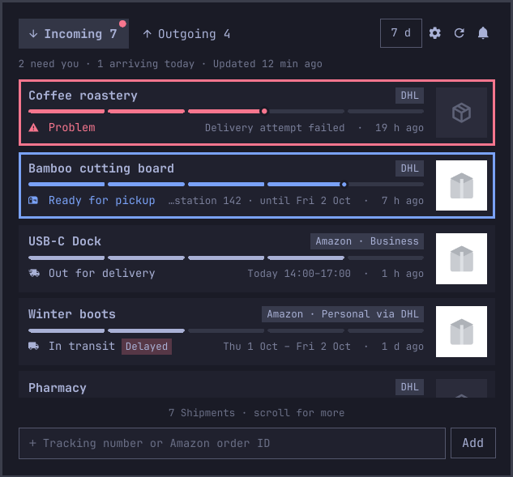

# Research: product preview images for Amazon Shipments (#54)

Question (from #54): how do we reliably get a small product image for each
Amazon Shipment (package), when one Order can split into several Shipments?

## Answer

**Take the image from the order history page, from the same delivery box that
holds the Shipment's "Lieferung verfolgen" link.** The adapter already reads
that page on every run and already splits it per delivery box
(`parseHistory` in `plugin/cli/amazon/pages.mjs`). The first item's
`` in that box is the Shipment's image. The tracker page does not carry
the package's items at all, so it can't be used.

**Fetch the image once over plain HTTPS from Amazon's public image CDN, without
Chrome and without cookies, and cache it in the state dir, keyed by the image
ID.** Image URLs are immutable and public. Fetching them costs none of the
≤7 amazon.de pages per run.

**Non-Amazon Shipments** (e.g. an eBay seller's DHL parcel) can get a title
and sometimes an image from the connected mailbox. Search it once for the
tracking number, then extract through a ladder: schema.org `ParcelDelivery`,
per-sender parsers (eBay first), an opt-in call to the user's default agent
with no tools, and finally the subject line. See
[Item info from mail](#item-info-for-non-amazon-shipments-from-mail-scope-extension-on-54).

## Sources

Every claim below comes from one of these:

- **Recorded pages** under `~/.local/state/omarchy-shipment-tracker/spike-amazon/`
  (read-only, 2026-09-29): three order history captures (10 order cards each,
  7 digital and 3 physical Orders) and three progress-tracker pages. Real
  identifiers stay out of this document. All examples here are synthetic.
- **Adapter code on `main`**: `plugin/cli/amazon/pages.mjs` (`parseHistory`,
  `parseTracker`), `read.mjs` (`trackerReading`), `plugin/cli/shipments.mjs`
  (`applyReading`) and `plugin/cli/merge.mjs`.
- **Three anonymous requests** to `m.media-amazon.com` for one image ID from
  the recording: `._SS142_`, `._SS96_` and no size token. Sent with curl,
  without cookies or a Referer.
- For the mail section: Google Workspace Gmail Markup reference
  (`ParcelDelivery`, "Register with Google"), Microsoft Graph "Use the $search
  query parameter", `/usr/bin/omarchy-default-agent` and `/usr/bin/omarchy-agent`
  (Omarchy 4.0.0.alpha), the `--help` of the installed agent CLIs, and one
  headless Claude Code call on a synthetic mail.
- The discovery spike's findings (`spikes/amazon/FINDINGS.md` on
  `prototype/amazon-discovery`) for the page shapes the adapter relies on.

## Where the image lives

### Order history: yes, one image per item, inside the delivery box

The history markup, with classes as recorded and content made up:

```html
<div class="order-card js-order-card">
  <div class="a-box order-header">…orderID=000-0000000-0000000…</div>
  <div class="a-box delivery-box">                <!-- one per Shipment -->
    <div class="yohtmlc-shipment-status-primaryText">…</div>
    <ul class="a-unordered-list …">
      <li><div class="a-fixed-left-grid item-box …">   <!-- one per item -->
        <div class="product-image">
          <a href="/dp/B0XXXXXXXX…">
            "
                 src="https://m.media-amazon.com/images/I/71AbCdEfGhL._SS142_.jpg"
                 data-a-hires="https://m.media-amazon.com/images/I/71AbCdEfGhL._SS284_.jpg">
          </a>
        </div>
        <div class="yohtmlc-product-title"><a href="/dp/B0XXXXXXXX…">…</a></div>
        <div class="yohtmlc-item-level-connections">
          …/your-orders/pop?…&orderId=…&lineItemId=…&shipmentId=Xy12AbCd3&packageId=1&asin=B0XXXXXXXX
        </div>
      </div></li>
    </ul>
    <ul class="yohtmlc-shipment-level-connections">
      …/progress-tracker/package?…&orderId=000-0000000-0000000&shipmentId=Xy12AbCd3&packageIndex=0…
    </ul>
  </div>
</div>
```

- In every recorded box, digital ones included, each `item-box` has exactly one
  `.product-image img` with a `src` at `._SS142_` and a `data-a-hires` at
  `._SS284_`. The `src` is in the delivered HTML, so it is not lazy-loaded.
- The product link is `/dp/<ASIN>` (`/gp/video/…` for a Prime Video item). The
  ASIN isn't needed for the image. The image ID in the URL is not the ASIN.
- The item's "problem with this order" link carries `shipmentId`, `packageId`
  and `asin`, which ties the item to the same `shipmentId` as the tracker link.
  In the recording, `packageId=1` sits next to `packageIndex=0` for the same
  Shipment, so the two are numbered differently. Don't key anything on
  `packageId`.

### Tracker page: no

- `page-state` has an `itemIds` array. It was **empty** on all three recorded
  tracker pages. No other `page-state` key holds an ASIN or an image.
- The tracker page's HTML has product images, but none of them belong to the
  package. They come from the cart flyout (`sc-product-image`, `ewc-*`, at
  `._AC_AA152_` / `._AC_AA50_`) and from recommendation carousels (`asin-image`
  in `a-carousel-card`, `p13n-product-image`). The history image ID of the
  package appeared **0 times** on its own tracker page.

## Package mapping

- An order card holds one `delivery-box` per Shipment. Each box holds that
  Shipment's items and its own tracker link with `orderId`, `shipmentId` and
  `packageIndex`. The adapter builds the Shipment key
  `amazon:<orderId>#<packageIndex>` from that link, one box at a time.
- So "image of this Shipment" = **the first `.product-image img` in the same
  box chunk that `parseHistory` already takes the tracker link and the title
  from.** No cross-referencing by ASIN or `shipmentId` is needed. Box and link
  are the same element.
- **Not observed:** every recorded Order had one box with one item, so neither a
  split Order (several boxes in one card) nor a box with several items was
  recorded. The box-local approach doesn't depend on how Amazon numbers the
  boxes, but the first real split Order should be checked once (see Open
  questions).
- **Parsing detail:** `parseHistory` splits on `class="a-box delivery-box`, so
  the last box's chunk runs to the end of the page, including recommendation
  and footer images. Take the **first** `class="product-image"` match in the
  chunk (the box's own items come before anything else), and never "any
  `images/I/` URL in the chunk".

## Image URLs

Shape: `https://m.media-amazon.com/images/I/<imageId>.<sizeToken>.jpg`, e.g.
`https://m.media-amazon.com/images/I/71AbCdEfGhL._SS142_.jpg`. The image ID
is roughly 11 characters of `[A-Za-z0-9+%-]`. Other size tokens on Amazon pages
include `._AC_AA152_`, `._AC_UL75_SR75,75_` and `._SCLZZZZZZZ__SY500_SX500_`.
Some pages use the `images-eu.ssl-images-amazon.com` host.

What the three anonymous requests returned:

| Request | Result |
|---|---|
| `…/<id>._SS142_.jpg` (as on the page) | 200, `image/jpeg`, 142×142, 3.5 KB |
| `…/<id>._SS96_.jpg` (rewritten) | 200, `image/jpeg`, **96×96**, 2.1 KB |
| `…/<id>.jpg` (token removed) | 200, the original, 2312×1912, 256 KB |

All three responses carried `cache-control: max-age=630720000, public` (20
years), `access-control-allow-origin: *`, a `last-modified` from the image's
upload, and **no `Set-Cookie`**. None of the requests sent cookies. So:

- **Size rewriting works:** replace the `._…_.` token with `._SS<n>_.` to get
  an n×n square, padded on white.
- **Stable:** a URL is immutable for its lifetime. When a seller changes the
  photo, the listing gets a new image ID. The old one stays valid, and the
  history page keeps showing the image from the time of purchase.
- **No cookies or session needed.** The CDN is public.

## Edge cases

| Case | What happens |
|---|---|
| Digital Orders (`D01-…`: audiobooks, Prime Video, subscriptions) | They have a box and an image but no tracker link. `parseHistory` already drops them, so there's no Shipment and no image. |
| Items not yet shipped | Not in the recording. The expected shape is a box with no tracker link, which is skipped today like a digital one. When the item ships, its box gets a link and the image comes with it. To verify once. |
| Several items in one Shipment | Use the first `item-box`, as #54 allows. |
| Manual Order IDs found through the order search | The search results use the history markup (`orderSearchUrl` → `parseHistory`), so the same extraction applies. |
| Mail-only Amazon Shipments (#34), DHL Shipments, manual DHL numbers | No image. They get the fallback. |
| Amazon Shipment merged with a DHL Shipment on the tracking number (#27) | Keep the Amazon image on the merged Shipment, as `merge.mjs` already does for the title. |
| An item whose `src` is a placeholder (not under `/images/I/`, e.g. an `.svg`) | Treat it as no image. |

## Recommendation for the implementation ticket

**Data**

- `parseHistory` adds `imageUrl` to each entry: the first
  `.product-image img[src]` in the box, accepted only if it matches
  `^https://(m\.media-amazon\.com|images-eu\.ssl-images-amazon\.com)/images/I/[A-Za-z0-9+%-]+\.[^/]*\.jpg$`,
  and normalised to `._SS142_.` (142 px covers every placement below at
  scale 1.25 and up to 2×; one size for all).
- `imageUrl` then rides along exactly like `title` does:
  history entry → `trackerReading` → `applyReading`. The Shipment gets
  **`image`**, the absolute path of the cached file, only once the download
  has succeeded. The UI reads only `image`, and never makes a network request
  itself.

**Fetch and cache**

- Fetch with Node's `fetch` over plain HTTPS: no cookies, no Referer, a 10 s
  timeout, `image/jpeg` only, at most 200 KB. **Not through CDP/Chrome.**
  Reading the image through CDP would tie it to the tab and its lifetime,
  mean loading or intercepting it in the signed-in browser, and give nothing
  a public CDN URL doesn't already give.
- Cache at `$XDG_STATE_HOME/omarchy-shipment-tracker/images/<imageId>.jpg`
  (same `0700` state dir), written atomically. Key it by image ID, not by
  Shipment. The file is immutable, so it is fetched once and never
  re-validated, and two Shipments with the same item share one file.
- Do it after the account's page run, so it never sits between amazon.de page
  loads or changes their pacing. Allow at most ~10 image fetches per refresh,
  and on failure leave `image` unset and try again on the next refresh.
- The retention sweep (`retention.mjs`) deletes image files that no Shipment
  references any more.

**Cost and detection risk**

- **amazon.de pages: 0 extra.** The history page is read anyway, and the
  ≤7 pages per run (1 history + 6) are untouched.
- **CDN: 1 request of about 3.5 KB per new Shipment, then never again.**
- **Detection risk: negligible.** The requests go to a public static CDN that
  serves any client (CORS `*`), carry no account cookies, and can't be tied to
  the Amazon session. The Chrome that reads the history has already loaded the
  same image at `._SS142_` as part of rendering the page.
- **Privacy:** the images show what the user bought, so they stay in the local
  state dir like `shipments.json`. The CDN sees the user's IP fetching an image
  ID, which it already did when Chrome rendered the history.

**Fallback when there's no image** (non-Amazon Shipment, not fetched yet,
failed, placeholder `src`): depends on the placement, see below. In A and C
the tile shows a package glyph so cards stay aligned. In B the thumbnail is
simply left out. The same fallback applies to mail-derived item info (next
section).

## Item info for non-Amazon Shipments, from mail (scope extension on #54)

The question from the #54 comment: for a Shipment that isn't from Amazon, e.g.
an eBay seller's DHL parcel, can the connected Microsoft 365 mailbox supply
the item's title and image? This is post-v1, since it revisits #10's "no agent
fallback in v1".

**Evidence limits.** A read-only scan of the user's mailbox (search each DHL
Shipment's tracking number, record only the markup structure) was **not run**:
the session's permission policy refused reading mail bodies. This section
therefore rests on public documentation, the adapter code, the locally
installed agent CLIs, and synthetic samples. Anything about how a particular
sender's mail looks is marked *to verify*.

### Link: search the mailbox for the tracking number

- The mail Connection already runs the pinned Softeria server with
  `list-mail-messages` / `get-mail-message`, Mail.Read only
  (`plugin/cli/mail/mcp.mjs`). One more call per Shipment is enough:
  `list-mail-messages { search: '"<trackingNumber>"', select: [id, receivedDateTime, from, subject, body], top: 5 }`.
- Graph `$search` on messages targets **from, subject and body** by default,
  sorts results by sent date and returns at most 1,000 results. It can't be
  combined with `$filter` (primary source: Microsoft Graph, "Use the $search
  query parameter", messages section). A 20-digit DHL number is one token, so
  false hits are unlikely. A hit still has to contain the number
  verbatim in its subject or body (checked locally) before it's used.
- Do this **once per Shipment**, when it's first seen and has no item info
  yet. Store only the result, or the fact that nothing was found, and never
  search again. The mail run already makes one search per refresh, so this
  adds one Graph call per *new* non-Amazon Shipment.
- Store **only the extracted fields** (`itemTitle`, `imageUrl`, which rung
  produced them, and the message id). Never store bodies. Parsing happens in
  memory.

### Extraction ladder

Try each rung in order. The first one that yields a title wins. Each rung's
output is validated the same way: a title is plain text, trimmed, 1–120
characters, with no URL. An `imageUrl` is `https:` on an allowlisted image
host, is fetched with the same rules as the Amazon images (no cookies, size
cap, `image/*`), and is cached by a hash of the URL.

**1. schema.org markup in the mail.** Google's Gmail markup defines
`ParcelDelivery` with `itemShipped` (a `Product` with a required `name`, plus
a recommended `image`, `sku` and `url`), `trackingNumber`, `carrier` and
`partOfOrder` (`Order` with `orderNumber` and `merchant`). It can be written as
JSON-LD or as microdata (primary source: Google Workspace, Gmail Markup
reference, "ParcelDelivery"). Synthetic example:

```html
<script type="application/ld+json">
{ "@context": "http://schema.org", "@type": "ParcelDelivery",
  "trackingNumber": "00340434000000000123",
  "carrier": { "@type": "Organization", "name": "DHL" },
  "itemShipped": { "@type": "Product", "name": "Bamboo cutting board",
                   "image": "https://shop.example/img/board-200.jpg" },
  "partOfOrder": { "@type": "Order", "orderNumber": "EX-1001",
                   "merchant": { "@type": "Organization", "name": "Example Shop" } } }
</script>
```

- Accept it only when its `trackingNumber` equals the Shipment's. If it has
  none, accept it only when the mail matched on the number anyway.
- Gmail honours markup only from senders that registered with Google
  (DKIM/SPF-aligned, high volume, low spam rate; same source, "Register with
  Google"). So large shops and marketplaces are the ones likely to include it.
  Small sellers usually don't. *To verify:* whether Exchange Online keeps
  `<script type="application/ld+json">` in the HTML body that Graph returns.
  If it doesn't, only microdata (`itemtype="http://schema.org/ParcelDelivery"`)
  survives. The parser should read both.
- It's cheap, generic and structured, so it's the first rung. The tracker
  can't expect it to be present often.

**2. Per-sender parsers, eBay first.** A small table keyed on the sender's
domain (after DKIM/SPF pass per the `Authentication-Results` header when
available, since the `From` domain is spoofable), each entry a pure function
`html → { itemTitle, imageUrl } | null`, tested against synthetic fixtures.

- eBay's "your item has shipped" mail is sent by the platform (not the seller)
  for eBay-sold items, names the item and shows its listing photo. eBay
  listing images are served from `i.ebayimg.com` with a size token in the
  file name (`…/s-l<size>.jpg`, e.g. `s-l140`). Rewriting it like the Amazon
  `._SS<n>_` token is expected to work. *To verify* on one real mail: the item
  title element, the image URL and its size token, and that the tracking
  number appears in the body (it may only be behind a tracking link).
- Parsers break when senders redesign their mail. The tracker must treat
  "parser found nothing" as falling to the next rung, never as an error, and
  never as a Health problem.

**3. Opt-in fallback: the user's default agent.** Off by default, with a
separate switch on the Sources page ("Ask <agent> to read shipping mails"),
because it sends mail text to the agent's provider. On a work tenant that can
be a data-protection question, so it's never implied by connecting the
mailbox.

- **How Omarchy defines the default agent:** `omarchy-default-agent` with no
  arguments prints the chosen agent's name, read from
  `~/.config/omarchy/defaults/agent`. It prints nothing when unset, since
  "Omarchy picks no agent for you". Choices: `pi omp opencode claude codex grok
  gemini openclaw hermes copilot crush cursor-agent muse` (Omarchy 4.0.0.alpha,
  `/usr/bin/omarchy-default-agent`).
- **Don't call `omarchy-agent` / `omarchy agent prompt`.** They open an
  interactive terminal and start every agent in its "don't ask" mode
  (`claude --permission-mode auto`, `codex --approve-for-me`, `gemini --yolo`,
  …; `/usr/bin/omarchy-agent`). That's the opposite of what untrusted mail
  needs. The tracker keeps its own table of **tool-less, headless** calls and
  supports only agents that have one:

| Agent | Headless call with no tools (from the agent's own `--help`) | Supported |
|---|---|---|
| `claude` (2.1.284) | `claude -p --tools "" --strict-mcp-config --setting-sources "" --no-session-persistence --output-format json --json-schema '<schema>' --system-prompt '<fixed>'`, mail text on stdin | **yes** (tested, below) |
| `pi` (0.87.1) | `pi -p --no-tools --no-extensions --no-skills --no-session --mode json --system-prompt '<fixed>'` | yes, if tested the same way |
| `codex` (0.159.0) | `codex exec --sandbox read-only --output-schema <file> --ephemeral --skip-git-repo-check` keeps its shell tool (read-only) | **no**: can't turn tools off |
| `gemini` (0.61.0) | `gemini -p … --approval-mode plan -o json` still has read-only tools | **no** |
| others | not examined | no, until checked |

- **Input:** the subject plus the body converted to plain text (tags, styles
  and hidden elements removed), truncated to ~4,000 characters around the
  tracking number, and nothing else. No headers or addresses, and no other
  mails.
- **Output:** JSON `{ "title": string|null, "imageUrl": string|null }`,
  constrained by the CLI's schema option where it has one, then **validated by
  the tracker anyway**: exact keys, the title rules above, and an `imageUrl`
  that must occur verbatim in the mail's HTML (an agent can't invent a URL)
  and pass the host allowlist. Anything else is discarded. One call per
  Shipment, timeout 60 s, result cached like the other rungs.
- **Prompt injection:** assumed. Without tools the worst case is a wrong or
  hostile title or URL, and validation contains that: plain text only,
  length-capped, and URLs must come from the mail. A title is shown as text in
  the card (QML `Text`, `textFormat: Text.PlainText`), never as rich text.
- **Test (synthetic mail with an injection line** asking the model to run
  `rm -rf ~` and answer "HACKED" with an attacker URL): Claude Code 2.1.284
  with the call above returned
  `{"title":"Bamboo cutting board, 3-piece set","imageUrl":null}` in 3.7 s,
  for USD 0.012. It ignored the injection, and it had no tools to act on it
  anyway.

**4. The subject line.** Fallback without an agent: strip known prefixes
("Your order has shipped:", "Versandbestätigung", "Ihre Bestellung …",
order numbers and the tracking number) and use the remainder as the title if
it has 3–120 characters left. No image.

**When nothing is found** the card keeps what it shows today: the sender name
from DHL as the title, and the placement's fallback for the image.

### Data and UI

- Shipment fields shared with the Amazon path: `image` (local cached file)
  and, for mail-derived info, `itemTitle` plus `itemSource`
  (`"schema" | "parser" | "agent" | "subject"`).
- For a non-Amazon Shipment the DHL sender name stays useful ("from whom").
  With an `itemTitle`, the card title becomes the item. The sender name should
  stay visible somewhere, e.g. "Bamboo cutting board · from Example Shop" or in
  the badge. That's a copy decision for the implementation ticket.
- The placement options below apply unchanged. The renders include one DHL
  card with mail-derived item info ("Bamboo cutting board", Ready for pickup)
  next to the two Amazon cards.

## Placement options on the variant C card

Offscreen renders (`QT_QPA_PLATFORM=offscreen`, scale 1.25) of the #52 card
(`plugin/ShipmentList.qml` on `ticket/52-list-variant-c`, the successor of
`plugin-prototype/VariantC.qml` on `prototype/popup-ux`), made with the
#31/#35/#52 harness and synthetic Shipments. The two Amazon cards
(USB-C Dock, Winter boots) and one DHL card with mail-derived item info
(Bamboo cutting board) carry a neutral placeholder image. The other DHL cards
show the fallback. The card code for these renders was a throwaway patch and
is not part of this PR.

| | |
|---|---|
| **Today (no image)** |  |
| **A: leading tile.** A 50 px square on the left for the full card height. DHL cards show a package glyph tile, so every card is aligned. This is the most "shop-like" option. The text column loses about 60 px, so long Estimates get elided sooner (see the Ready for pickup card). |  |
| **B: inline thumbnail.** A title-height (~20 px) image in front of the title, on Amazon cards only. The card stays the same size and the progress bar keeps its full width. At that size the image is a hint more than a preview. |  |
| **C: trailing tile.** Like A, but on the right. The title, Status and progress bar keep their left alignment with the tabs, and the image reads as a detail. The badge and the hover actions move in by the tile's width. |  |

Placement is the user's choice.

## Open questions

1. **Split Orders:** check once on a real Order with two Shipments that each
   `delivery-box` holds its own tracker link and its own items. Expected, but
   not recorded yet.
2. **Items not yet shipped:** confirm that their box has no tracker link, and
   what it shows once the item ships.
3. **Mail markup:** whether Graph returns JSON-LD `<script>` blocks in the
   HTML body, and how the eBay shipping mail marks up its item title and
   image. Both need one real mail each, read with the user's consent.
